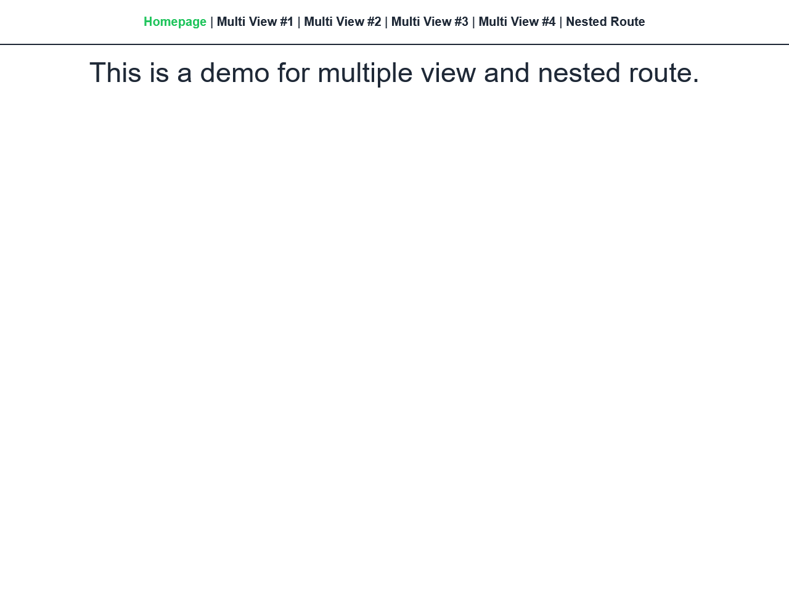

# Demo for Multiple View and Nested Route

## Project Preview



- - -

## This project is currently built on
* [JavaScript](https://developer.mozilla.org/en-US/docs/Web/JavaScript)
* [Vue.js](https://vuejs.org/)
* [Vue CLI](https://cli.vuejs.org/)
* [Vue Router](https://router.vuejs.org/)
* [Tailwind CSS](https://tailwindcss.com/)

- - -

## Project setup
```
yarn install
```

### Compiles and hot-reloads for development
```
yarn serve
```

### Compiles and minifies for production
```
yarn build
```

### Lints and fixes files
```
yarn lint
```

### Customize configuration
See [Configuration Reference](https://cli.vuejs.org/config/).

- - -

## Project Directory Explanation
    /src               - root directory of source code
    /src/router        - router setting
    /src/views         - view files
    /src/components    - view component files
    /src/assets        - root directory of static files
    /public            - static resource

